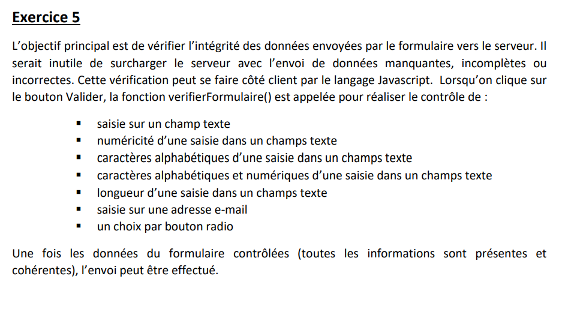

# Formulaire

créer à partir de consigne du TP_2 exercice 5 dont voici la consigne :

Ce projet est organisé de la façon suivante :

- dans le répertoire js se trouve le fichier script.js qui permet de réaliser la vérification du formulaire de index.html
