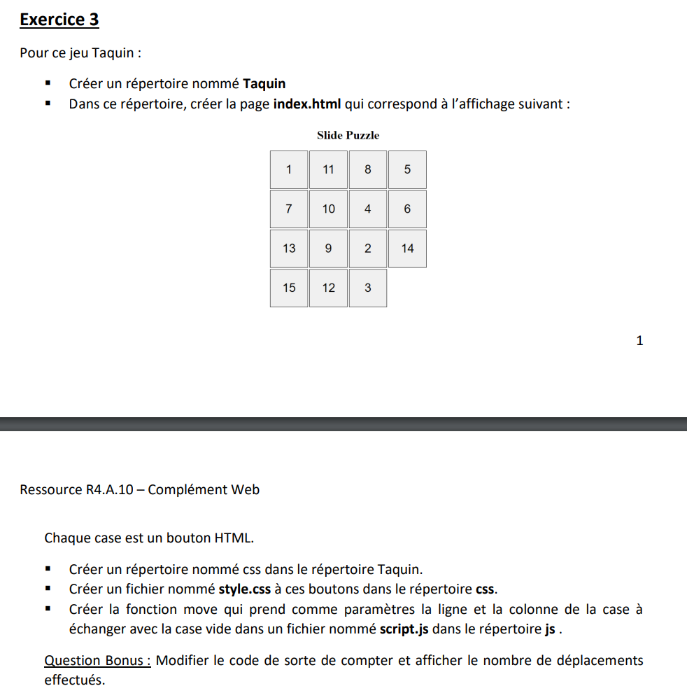

# Jeu du Taquin

créer à partir de consigne du TP_2 exercice 3 dont voici la consigne :

Ce projet est organisé de la façon suivante :

- index.html la page web
- le dossier css avec style.css, le style de la page
- le dossier js avec script.js, la partie JavaScript du projet

Dans le fichier script.js se trouve la fonction move qui permet de déplacer les case dans le respect des règles du jeu du taquin.
